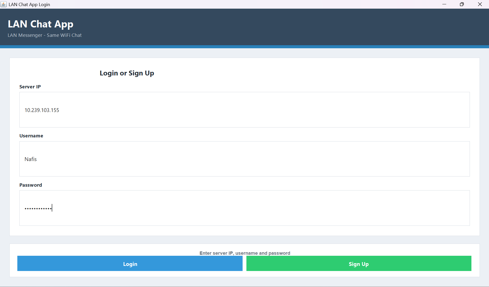
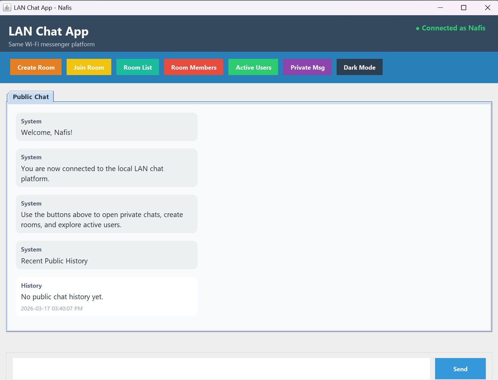
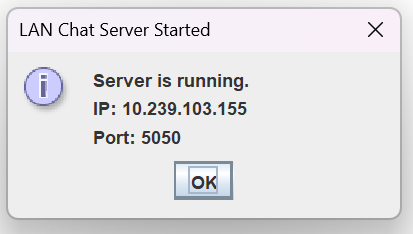
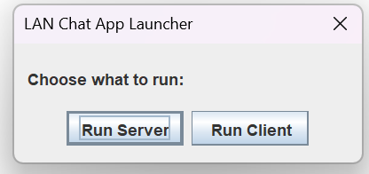

## 🧠 What I Learned

- Built a real-time LAN messaging system from scratch
- Implemented socket-based client-server architecture
- Designed multi-threaded communication handling
- Developed modern UI using Java Swing
- Integrated SQLite for persistent user data
- Designed JSON-based messaging protocol
-## 📸 Screenshots

  
  

  
  

